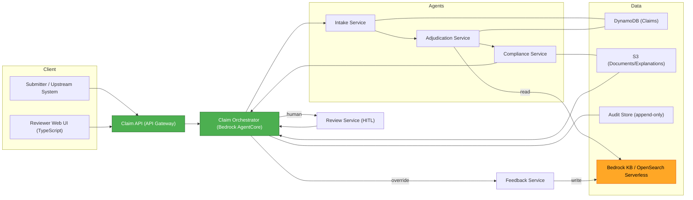

# CLAIRO - Application Design (Consolidated)

**Project**: CLAIRO — Agentic Insurance Claims Adjudication (MVP)
**Date**: 2026-07-06

This document consolidates `components.md`, `component-methods.md`, `services.md`, and `component-dependency.md`.

---

## 1. Design Decisions (from Application Design plan)
| # | Decision | Choice |
|---|---|---|
| Q1 | Component granularity | Medium — agents split into logical sub-parts |
| Q2 | Orchestration style | Hybrid — orchestrator sequence + events for HITL wait & feedback |
| Q3 | Claim state | Single DynamoDB claim record with status field |
| Q4 | KB access | Adjudication reads; Feedback writes |
| Q5 | UI ↔ backend | Shared REST API with role-scoped endpoints |
| Q6 | Human review wait | Pause/async — persist task, resume on reviewer action |

## 2. Architecture Overview

### Text Alternative
Submitter/Upstream and Reviewer UI call the shared Claim API. The API invokes the Claim Orchestrator (AgentCore), which also starts from S3 upload events. The Orchestrator runs Intake → Adjudication → Compliance. Adjudication reads the Knowledge Base. After compliance, routing either auto-finalizes or pauses for human review. The Review Service serves reviewers and resumes the Orchestrator. Overrides trigger the Feedback Service, which writes back to the Knowledge Base. DynamoDB holds claim records, S3 holds documents/explanations, and an append-only store holds the audit trail.

## 3. Components (summary)
- **Intake**: OCR Adapter, Email/Text Parser, LLM Extractor, Claim Normalizer
- **Adjudication**: KB Retriever (read), Decision Reasoner
- **Compliance**: GDPR Rule Validator, Explanation Generator
- **HITL**: Routing Evaluator, Review Task Manager, Evidence Highlighter
- **Feedback**: Feedback Ingestor (write)
- **Shared Platform**: Claim Repository, Document Store, Audit Logger, Config Provider, Identity & Access

*(Full responsibilities and interfaces in `components.md`; method signatures in `component-methods.md`.)*

## 4. Services / Orchestration (summary)
Claim Orchestrator (S1) drives Intake (S2) → Adjudication (S3) → Compliance (S4) → Routing; Review Service (S5) handles HITL; Feedback Service (S6) handles KB write-back; Claim API Service (S7) exposes role-scoped endpoints.

*(Full detail and interaction diagram in `services.md`.)*

## 5. Dependencies & Data Flow (summary)
Agents are mediated by the Orchestrator (no direct agent-to-agent calls). KB read/write are separated. Shared platform components are cross-cutting.

*(Full matrix and data-flow diagram in `component-dependency.md`.)*

## 6. Claim Status Lifecycle
`Received → Intake Complete → Adjudicated → Compliance Checked → (Decided | Pending Review → Decided)`

## 7. Traceability to Requirements & Stories
| Design element | Requirements | Stories |
|---|---|---|
| Intake components + Intake Service | FR-1.x | US-01, US-02, US-03 |
| Adjudication components + Service | FR-2.x | US-04 |
| Compliance components + Service | FR-3.x | US-05 |
| Routing Evaluator + Review Service | FR-4.x, FR-6.x | US-06, US-07 |
| Feedback Service | FR-5.x | US-08 |
| Claim API + status retrieval | FR-7.x | US-01, US-09 |
| Identity & Access | FR-8.x, FR-6.3 | US-12 |
| Audit Logger | FR-9.x | US-11 |
| Config Provider (threshold) | FR-4.1, NFR-6.1 | US-10 |

## 8. Consistency Validation
- All 12 user stories map to at least one component/service. ✔
- All functional requirement groups (FR-1..FR-9) are covered. ✔
- KB read/write separation, single claim record, hybrid orchestration, shared API, and pause/async review are consistently applied across all artifacts. ✔
