# Execution Plan

**Project**: CLAIRO — Agentic Insurance Claims Adjudication (MVP)
**Date**: 2026-07-06

## Detailed Analysis Summary

### Change Impact Assessment
- **User-facing changes**: Yes — reviewer web UI, submitter API, status retrieval
- **Structural changes**: Yes — greenfield three-agent architecture + orchestration + data stores
- **Data model changes**: Yes — new canonical health-claim schema, decision records, audit records
- **API changes**: Yes — new claim ingestion, status, and review APIs
- **NFR impact**: Yes — AWS-native deployment, observability, configurability (security/resiliency/PBT baselines opted out)

### Risk Assessment
- **Risk Level**: High (regulatory domain, financial impact, multi-agent AI, real-decision feedback loop) — mitigated for MVP by synthetic data and pilot scope
- **Rollback Complexity**: Moderate (IaC-defined; greenfield so no legacy to break)
- **Testing Complexity**: Complex (multi-agent pipeline + HITL + feedback loop integration)

## Workflow Visualization

### Mermaid Diagram

```mermaid
flowchart TD
    Start(["User Request"])

    subgraph INCEPTION["INCEPTION PHASE"]
        WD["Workspace Detection<br/><b>COMPLETED</b>"]
        RA["Requirements Analysis<br/><b>COMPLETED</b>"]
        US["User Stories<br/><b>COMPLETED</b>"]
        WP["Workflow Planning<br/><b>COMPLETED</b>"]
        AD["Application Design<br/><b>EXECUTE</b>"]
        UG["Units Generation<br/><b>EXECUTE</b>"]
    end

    subgraph CONSTRUCTION["CONSTRUCTION PHASE"]
        FD["Functional Design<br/><b>EXECUTE</b>"]
        NFRA["NFR Requirements<br/><b>EXECUTE</b>"]
        NFRD["NFR Design<br/><b>EXECUTE</b>"]
        ID["Infrastructure Design<br/><b>EXECUTE</b>"]
        CG["Code Generation<br/><b>EXECUTE</b>"]
        BT["Build and Test<br/><b>EXECUTE</b>"]
    end

    subgraph OPERATIONS["OPERATIONS PHASE"]
        OPS["Operations<br/><b>PLACEHOLDER</b>"]
    end

    Start --> WD
    WD --> RA
    RA --> US
    US --> WP
    WP --> AD
    AD --> UG
    UG --> FD
    FD --> NFRA
    NFRA --> NFRD
    NFRD --> ID
    ID --> CG
    CG --> BT
    BT --> OPS
    BT --> End(["Complete"])

    style WD fill:#4CAF50,stroke:#1B5E20,stroke-width:3px,color:#fff
    style RA fill:#4CAF50,stroke:#1B5E20,stroke-width:3px,color:#fff
    style US fill:#4CAF50,stroke:#1B5E20,stroke-width:3px,color:#fff
    style WP fill:#4CAF50,stroke:#1B5E20,stroke-width:3px,color:#fff
    style AD fill:#FFA726,stroke:#E65100,stroke-width:3px,stroke-dasharray: 5 5,color:#000
    style UG fill:#FFA726,stroke:#E65100,stroke-width:3px,stroke-dasharray: 5 5,color:#000
    style FD fill:#FFA726,stroke:#E65100,stroke-width:3px,stroke-dasharray: 5 5,color:#000
    style NFRA fill:#FFA726,stroke:#E65100,stroke-width:3px,stroke-dasharray: 5 5,color:#000
    style NFRD fill:#FFA726,stroke:#E65100,stroke-width:3px,stroke-dasharray: 5 5,color:#000
    style ID fill:#FFA726,stroke:#E65100,stroke-width:3px,stroke-dasharray: 5 5,color:#000
    style CG fill:#4CAF50,stroke:#1B5E20,stroke-width:3px,color:#fff
    style BT fill:#4CAF50,stroke:#1B5E20,stroke-width:3px,color:#fff
    style OPS fill:#BDBDBD,stroke:#424242,stroke-width:2px,stroke-dasharray: 5 5,color:#000
    style INCEPTION fill:#BBDEFB,stroke:#1565C0,stroke-width:3px,color:#000
    style CONSTRUCTION fill:#C8E6C9,stroke:#2E7D32,stroke-width:3px,color:#000
    style OPERATIONS fill:#FFF59D,stroke:#F57F17,stroke-width:3px,color:#000
    style Start fill:#CE93D8,stroke:#6A1B9A,stroke-width:3px,color:#000
    style End fill:#CE93D8,stroke:#6A1B9A,stroke-width:3px,color:#000

    linkStyle default stroke:#333,stroke-width:2px
```



### Text Alternative
```
INCEPTION:
- Workspace Detection (COMPLETED)
- Requirements Analysis (COMPLETED)
- User Stories (COMPLETED)
- Workflow Planning (COMPLETED)
- Application Design (EXECUTE)
- Units Generation (EXECUTE)

CONSTRUCTION (per unit):
- Functional Design (EXECUTE)
- NFR Requirements (EXECUTE)
- NFR Design (EXECUTE)
- Infrastructure Design (EXECUTE)
- Code Generation (EXECUTE)
- Build and Test (EXECUTE, after all units)

OPERATIONS:
- Operations (PLACEHOLDER)
```

## Phases to Execute

### 🔵 INCEPTION PHASE
- [x] Workspace Detection (COMPLETED)
- [x] Reverse Engineering (SKIPPED — greenfield, no existing code)
- [x] Requirements Analysis (COMPLETED)
- [x] User Stories (COMPLETED)
- [x] Workflow Planning (IN PROGRESS)
- [ ] Application Design - **EXECUTE**
  - **Rationale**: New system with multiple components (3 agents, orchestrator, APIs, UI, data stores). Component boundaries, methods, and service-layer interactions must be defined.
- [ ] Units Generation - **EXECUTE**
  - **Rationale**: The system decomposes naturally into multiple units of work (intake, adjudication, compliance, HITL/UI, shared platform/infra). Explicit units enable structured per-unit design and code generation.

### 🟢 CONSTRUCTION PHASE
- [ ] Functional Design - **EXECUTE** (per unit)
  - **Rationale**: New data models (canonical claim schema, decision/audit records) and complex business logic (adjudication, compliance validation, confidence routing, feedback loop).
- [ ] NFR Requirements - **EXECUTE** (per unit)
  - **Rationale**: AWS tech-stack selection per unit (Bedrock AgentCore, Textract, Knowledge Bases/OpenSearch Serverless, DynamoDB, S3, Cognito), plus performance/observability/configurability NFRs.
- [ ] NFR Design - **EXECUTE** (per unit)
  - **Rationale**: Translate NFRs into concrete patterns (async processing, logging/tracing, config-driven threshold, IAM scoping).
- [ ] Infrastructure Design - **EXECUTE** (per unit)
  - **Rationale**: Map logical components to concrete AWS services and define the AWS CDK (Python) stacks.
- [ ] Code Generation - **EXECUTE** (ALWAYS, per unit)
  - **Rationale**: Implement Python agents, TypeScript UI, and CDK infrastructure.
- [ ] Build and Test - **EXECUTE** (ALWAYS)
  - **Rationale**: Build all units and run unit/integration tests across the pipeline and HITL flow.

### 🟡 OPERATIONS PHASE
- [ ] Operations - PLACEHOLDER
  - **Rationale**: Future deployment and monitoring workflows; not in scope for this build.

## Extension Configuration (applies throughout)
- Security Baseline: **OFF**
- Resiliency Baseline: **OFF**
- Property-Based Testing: **OFF**

## Estimated Timeline
- **Total Stages to Execute**: 6 remaining (2 INCEPTION + 4 CONSTRUCTION design stages) + Code Generation + Build and Test, iterated per unit
- **Estimated Duration**: Multi-session; depends on number of units confirmed in Units Generation

## Success Criteria
- **Primary Goal**: A deployable AWS MVP where a claim flows through Intake → Adjudication → Compliance, routes low-confidence claims to a reviewer UI, and feeds overrides back into the knowledge base.
- **Key Deliverables**: Python agents, TypeScript reviewer UI, AWS CDK (Python) infrastructure, and per-claim audit trails.
- **Quality Gates**: End-to-end claim flow works; HITL routing honors configurable threshold; overrides captured and written back; full audit trail retrievable; system deploys via CDK.
